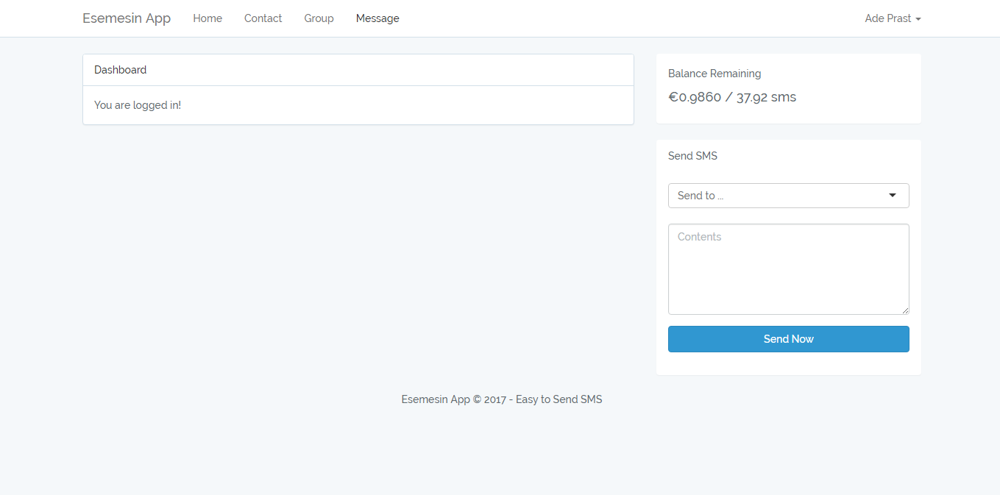

# Esemesin App
Simple web app personal dashboard for send sms to single contact or group contact. Build with Laravel 5.4 and Nexmo API. 

## Instalation 
* Clone or (Download dan Extract) 
* run `composer install`
* Create accound [Nexmo](https://www.nexmo.com/)
* Get API Nexmo and set Test Number
* copy file `.env.example` to `.env`
* run `php artisan key:generate`
* run `touch database\database.sqlite`
* Configuration `.env`
* run `php artisan migrate`

## Screenshoot

## If Error
* Try to configure `php.ini` about `Error cURL error 60: SSL certificate problem` or `cacert.pem` or `curl.cainfo`